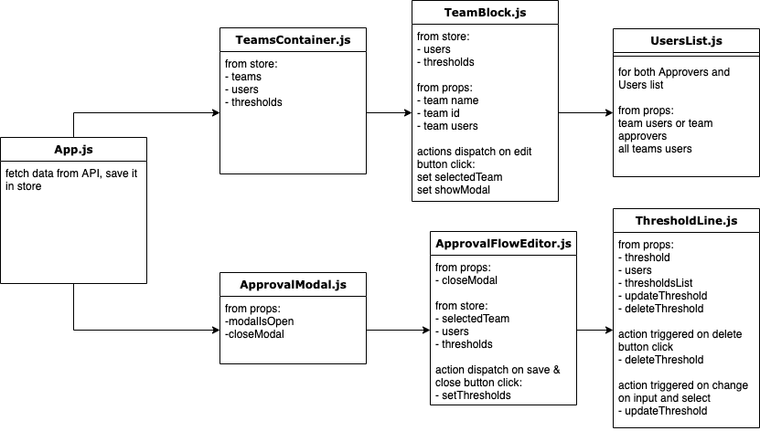

#SPENDESK FRONT-END TEST

In the project directory, you can run:

##### `yarn` or `npm install`

then

##### `yarn start` or `npm start`

Runs the app in the development mode. 
Open [http://localhost:3000](http://localhost:3000) to view it in the browser.

##### `yarn test` or `npm test`

Launches the test runner in the interactive watch mode. 

## Data store model

showModal: boolean

thresholds: array of object

- teamId: string,
- thresholds: array of object
- id: number
- floorValue: number
- roofValue: number
- approverId: string (aka userId)

users: array of object

- id: string
- first_name: string
- last_name: string
- email: string

teams:

- id: string
- name: string
- users: array of string

selectedTeam:

- name: string
- id: string
- users: array of string

## App structure

## Things not done or handle

- There is no verification of user input when creating a threshold. So a threshold can be created with any value, positive, negative...
- The use of selector could have been optimized
- The tests doesn't cover the whole app.
